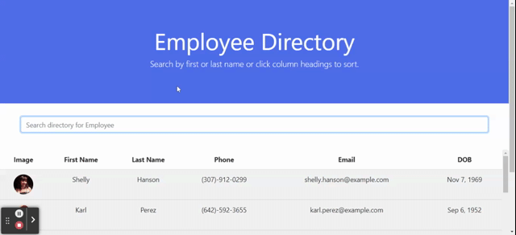

# Employee Directory

This project is deployed at [http://cgouge93.github.io/EmployeeDirectory](http://cgouge93.github.io/EmployeeDirectory).

## Description

A simple React.js app utilizing class components to generate an employee directory from a random user API.

## Usage

Navigate to [http://cgouge93.github.io/EmployeeDirectory](http://cgouge93.github.io/EmployeeDirectory). Begin typing a first or last name in the search bar to view results reactively display on the page. The table of results can be sorted by first name by clicking on the respective column headers.

## Screenshot of Deployed Application

